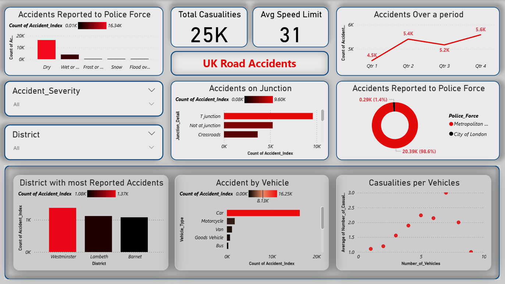

# UK Road Accidents Dashboard

A Power BI dashboard that visualizes the Accident rate, most repoted accident by vehicle, road conditions etc

---

## 📈 Key Insights
- **Total Causalities:** 25K 
- **Average Speed Limit:** 31 km/h  
- **Most Accident caused Vehicle:** Car  
- **Most Accident Caused Junction:** T Junction  

---

## 🧠 Features
- Accident Reports Investigated by Police Force 
- Accident rate over time 
- Districts with more than 1000 Accidents Reported  
- Causalities caused per vehicle

---

## 🛠️ Tools Used
- Power BI Desktop  
- Excel Dataset  
- DAX for measures  

---

## 🖼️ Dashboard Preview

---

## 👨‍💻 Created By
**Hari Niranjan S**  
📧 [harinjn1441@gmail.com](mailto:harinjn1441@gmail.com)  
🔗 [LinkedIn](https://www.linkedin.com/in/hariniranjans)
